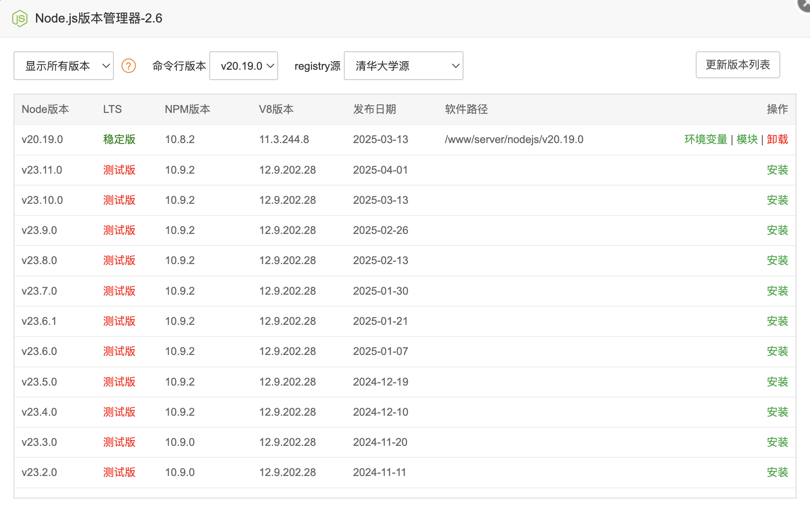
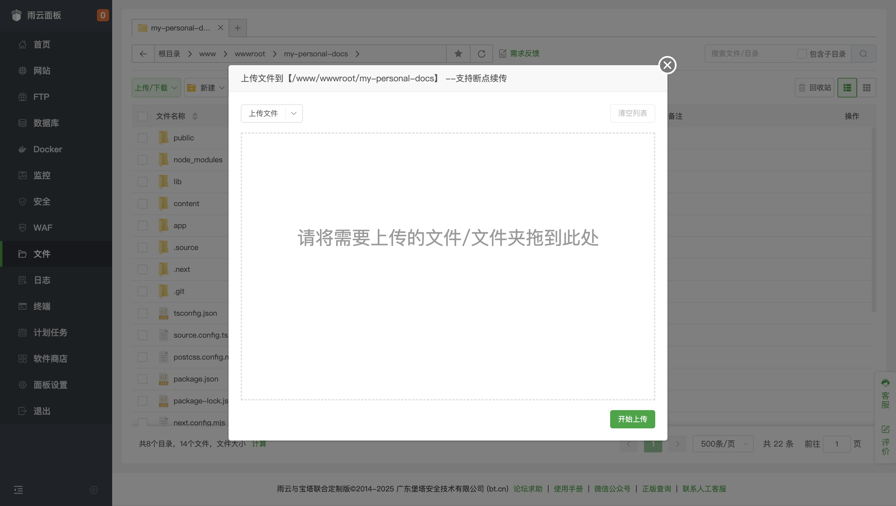
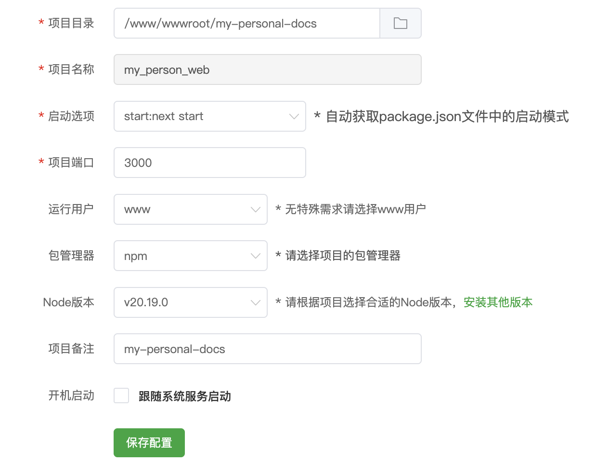

# 网站部署指南

欢迎来到网站部署指南！这篇文档将会指导你从零开始将网站部署到服务器上，并可在浏览器上通过服务器 IP 或域名访问哦！(*≧ω≦)ノ

真的很零基础！~~真的很零！~~

## 准备工作

### 1. 服务器

我们的网站需要一个稳定运行的环境，也就是服务器。市面上的选择有很多，基于**性能、价格和易用性**的考量，我推荐使用 **[雨云 (Rainyun)](https://www.rainyun.com/YUKITO_)**。他们的服务器对于运行我们这个项目来说，表现稳定且价格实惠。

**读者专属优惠：** 如果你决定尝试雨云，别忘了使用我的优惠码 **`YUKITO`** (通过 **[此链接注册](https://www.rainyun.com/YUKITO_)** 时填写)，可以获得**首月 5 折**的特别折扣。这是一个不错的开始方式，同时也能支持到我的创作！阿里嘎多！

**最低配置要求：** 为了保证网站后续运行流畅，服务器软硬件水平至少需要达到：

- CPU 核心数 ≥ 2 核
- 内存 (RAM) ≥ 2 GB
- 硬盘容量 ≥ 20 GB
- 系统推荐安装 Ubuntu 24.04.1 LTS

选择服务器时请务必留意这些参数，这样才能确保网站流畅运行。[雨云](https://www.rainyun.com/YUKITO_) 提供了符合这些条件的多种方案供你选择。

（~~虽然我在恰米~~，但真的很好用）

### 2. SSH 工具

要连接并管理服务器，我们需要使用 SSH (Secure Shell)，一般都选择电脑上的 **终端** 或 **命令提示符** 来完成。

- **macOS 用户：**

  1. 按下 `Command (⌘) + 空格键` 打开 Spotlight 搜索
  2. 输入 `Terminal` (或「终端」)
  3. 在搜索结果中找到并打开「终端」应用程序

  - *或者：* 打开 `Launchpad (启动台)`，在「其他」 (Utilities) 文件夹中找到「终端」

- **Windows 用户：**

  1. 按下 `Win + R` 键打开「运行」对话框
  2. 输入 `cmd` 并按回车键，打开「命令提示符」

  - *或者：* 也可以搜索并打开 `PowerShell` 或 `Windows Terminal` 

打开终端后，我们就可以使用 `ssh` 命令来连接服务器了。

## 部署步骤

### SSH 连接服务器

现在终端已经准备就绪，我们可以开始连接到服务器了。

1. **执行连接命令：** 在终端窗口中，输入以下命令。请**务必**将 `<your-server-ip>` 替换为你自己服务器的**公网 IP 地址**：

   ```bash
   ssh root@<your-server-ip>
   ```

   输入完毕后，按下 `Enter` (回车) 键。

2. **首次连接确认 (可能出现)：** 如果你是第一次从这台电脑连接该服务器，系统可能会显示一段关于服务器主机密钥真实性的信息，并询问 `Are you sure you want to continue connecting (yes/no/[fingerprint])?`。这是正常的安全提示，输入 `yes` 并按 `Enter` 即可。

3. **输入密码进行身份验证：** 接下来，系统会提示你输入密码 (通常显示为 `root@<your-server-ip>'s password:`)。这时，输入你服务器的 `root` 用户密码，然后按 `Enter`。 

   **请注意：** 出于安全原因，**输入密码时屏幕不会显示任何字符**。这是正常情况，只需准确输入密码后按回车即可。

4. **验证连接成功：** 如果终端显示类似下面的欢迎信息，其中包含你的服务器操作系统信息 (例如 Ubuntu 版本)，那么说明你已经成功登录到服务器啦！

   ```bash
   Welcome to Ubuntu 24.04.1 LTS (GNU/Linux 6.8.0-49-generic x86_64)
   # ... 其他信息 ...
   root@your-server-name:~# 
   ```

   现在你可以在这个终端里执行服务器命令了。

### 安装必要软件 (通过 SSH)

*   **更新软件包列表:**
    
    ```bash
    apt update
    ```
    
*   **安装 Git:**
    ```bash
    apt install git -y
    ```
    
* **安装 Node.js 和 npm:** 虽然可以通过命令行安装 (如使用 `nvm`)，但更推荐的方式是**通过宝塔面板安装**，这样方便管理版本。请登录宝塔面板 (通常是 `http://<your-server-ip>:8888`)，在 **软件商店** 中找到 **Node.js 版本管理器** 并安装一个推荐的 LTS 版本 **(Node.js  版本必须大于 20)**。

  **请注意：**

  - 如果你使用的是**[雨云 (Rainyun)](https://www.rainyun.com/YUKITO_)** 服务器，只需在雨云的管理云服务器页面的**「安装软件」**一栏下方点击宝塔面板进行安装即可。安装成功后，面板地址、用户名和密码等信息会显示在**「安装结果输出」**中。

  - 此外，你还需要在Node.js 版本管理器中将命令行版本设为**刚刚安装的版本**，如下图（作者安装的是 v20.19.0 版本）。



### 克隆代码库 (通过 SSH)

*   选择一个存放网站文件的目录。宝塔面板通常使用 `/www/wwwroot`。
*   进入该目录：
    ```bash
    cd /www/wwwroot
    ```
*   克隆项目：
    ```bash
    git clone https://github.com/yukito0209/my-personal-docs.git my-personal-docs
    ```
    *   *注意:* 如果你的仓库是私有的，可能需要配置 SSH 密钥或使用 HTTPS Token/密码进行验证。
*   进入项目目录：
    ```bash
    cd my-personal-docs
    ```

### 处理环境变量 (通过 SSH)

* 我们需要在服务器上创建 `.env.local` 环境变量文件。我们可以直接在本地创建。

* 添加必要的环境变量，例如，用于生产环境的 API 基础 URL：

  ```
  NEXT_PUBLIC_BASE_URL=http://<your-server-ip> # 或者你的域名
  # 其他需要的环境变量...
  ```

  保存后，通过宝塔面板的文件系统将文件上传到服务器的 `/www/wwwroot/my-personal-docs` 目录下。



### 安装依赖和构建项目 (通过 SSH)

以下操作均在 `/www/wwwroot/my-personal-docs` 目录下，可使用`cd /www/wwwroot/my-personal-docs` 命令转到该目录下。

*   安装项目依赖：
    ```bash
    npm install
    ```
*   构建 Next.js 应用：
    ```bash
    npm run build
    ```

### 配置宝塔面板 Node 项目

*   登录你的宝塔面板。
*   点击左侧菜单的「网站」。
*   在上方选择「Node项目」。
*   点击「添加Node项目」。
*   **填写配置信息:**
    *   **项目名称:** 填一个易于识别的名字，例如 `my_personal_web`。
    *   **项目目录:** 选择你之前克隆代码的路径，即 `/www/wwwroot/my-personal-docs`。
    *   **项目端口:** Next.js 默认启动在 3000 端口，保持 `3000` 即可。
    *   **Node版本:** 选择你之前安装的 Node.js 版本。
    *   **启动选项:** 选择 `start:next start`。
    *   **域名:** 输入你的服务器公网 IP 地址。如果你有域名，解析到这个 IP 后，可以输入你的域名。宝塔会自动配置 Nginx 反向代理。
    *   **备注:** 可选。
    *   **(可选) SSL:** 如果你使用了域名，可以在这里申请 Let's Encrypt 免费证书来启用 HTTPS。
*   点击 "提交"。宝塔会自动：
    *   使用 PM2 来管理你的 Node.js 进程（后台运行、自动重启等）。
    *   配置 Nginx 作为反向代理，将来自 80 端口（HTTP）或 443 端口（HTTPS）的请求转发到你应用的 3000 端口。
    *   (如果需要) 开放防火墙端口 80 和 443。



### 验证部署

*   在浏览器中访问**你的服务器 IP 或你配置的域名**。你应该能看到网站啦！
*   如果访问不成功，可以在宝塔面板「Node项目」页面查看项目日志，排查错误。也可以通过 SSH 运行 `pm2 logs my-personal-docs` 查看实时日志。检查宝塔的「安全」->「防火墙」设置，确保 80/443 端口是开放的。

## 后续更新和维护

当代码库有更新时，维护流程如下：

1. **SSH 连接服务器。**

2. **进入项目目录:** 

   ```bash
   cd /www/wwwroot/my-personal-docs
   ```

1.  **拉取最新代码:** `git pull origin master` 
2.  **安装/更新依赖 (如果 package.json/lock 文件有变动):** `npm install`。
3.  **重新构建项目:** `npm run build`。
4.  **重启网站应用:** 登录宝塔面板，在「网站」->「Node项目」中找到本项目，点击「重启」。

这样就实现了通过 Git 拉取更新，然后通过宝塔面板重启应用的便捷维护流程。

**若更新后网站未显示预期效果，请在服务器终端运行以下代码：**

```bash
# 1. 停止 Nginx 服务
sudo systemctl stop nginx
# 或者 sudo service nginx stop

# 2. 删除缓存目录下的所有文件
sudo rm -rf /www/server/nginx/proxy_cache_dir/*

# 3. 启动 Nginx 服务
sudo systemctl start nginx
# 或者 sudo service nginx start
```

运行后，尝试**重新构建项目并重启网站**。

## 支持作者

如果这篇文档对你有所帮助，请给本项目点一个 star 吧！